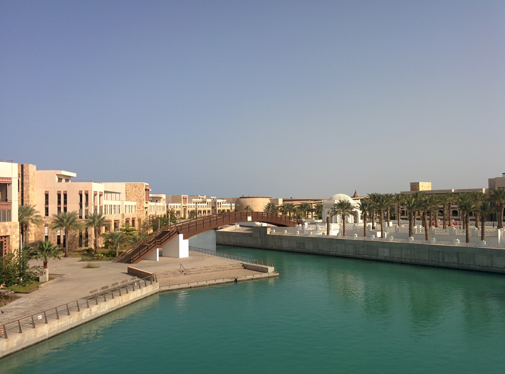
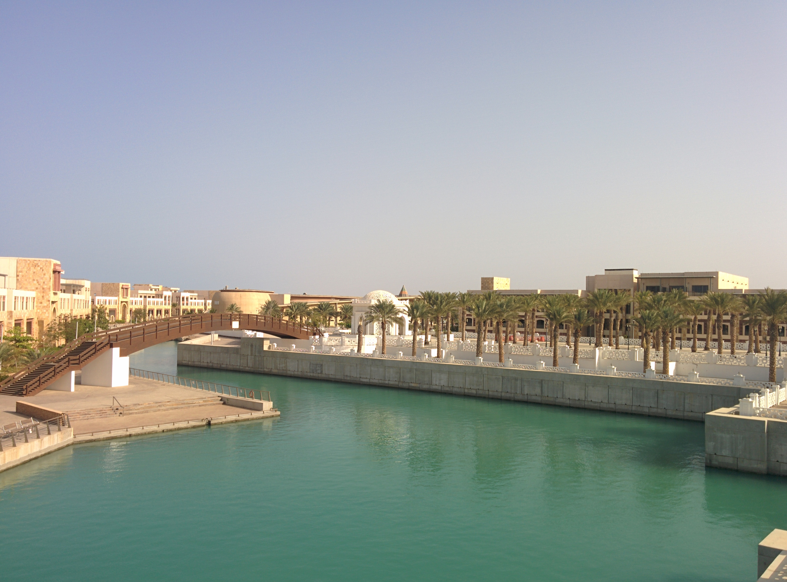
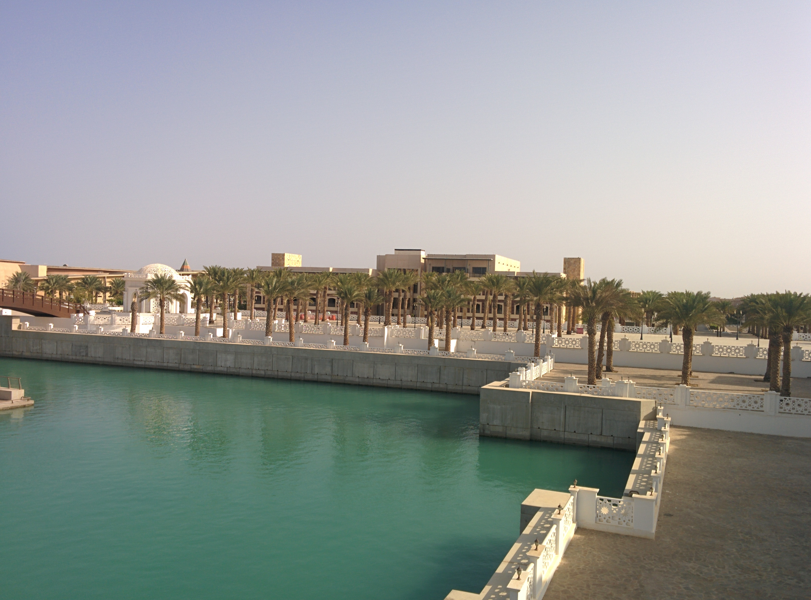

# Panoramas

## 概述

通过运行' python main.py '来执行全景图生成。

'main.py ' 将查看 ' images/source '下的每个子文件夹，对其中的图片实施全景图生成，并将输出保存到' images/output/ '下与输入文件夹同名的文件夹中。

## `panorama.py` 文件中的相关函数。

  - `getImageCorners`:输入图像的四个角的x, y坐标
  - `findHomography`:两个图像关键点之间的转换
  - `getBoundingCorners`:找到一个范围大到足以容纳两个图像的画布
  - `warpCanvas`:扭曲输入图像以与下一个相邻图像对齐,并将结果嵌入到画布中
  - `createImageMask`:创建一个 MASK 矩阵，代表图像的有效部分(True)
  - `createregionmask :创建三个 MASK 矩阵:一个只包含左 MASK 的True，一个只包含右和左 MASK 重叠的区域的True，一个只包含右 MASK 的True
  - `findDistanceToMask`:返回一个距离图，包含从每个 True 像素到最近的 False 像素的距离
  - `generateAlphaWeights`:根据左右距离图的比例创建alpha权重矩阵

## 效果

原图

合成

